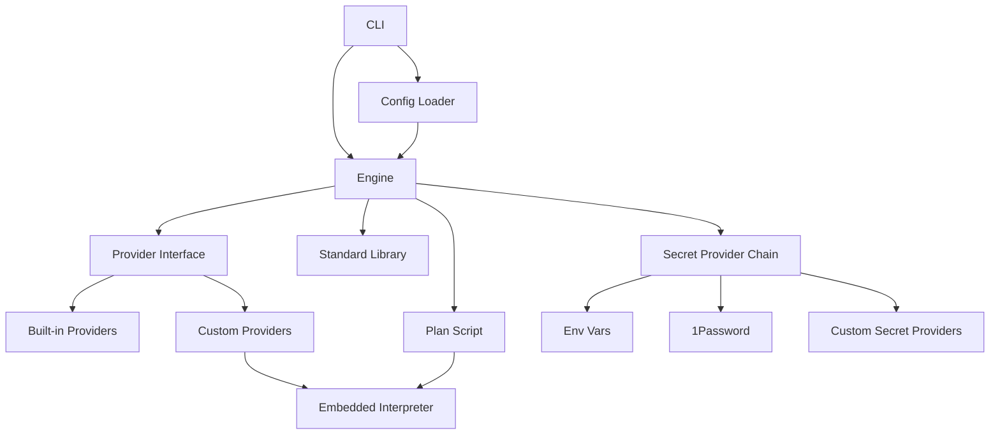

---
dun:
  id: SD-001
  depends_on:
    - FEAT-001
    - FEAT-002
---
# Solution Design: SD-001 - Anneal Engine

**Feature**: [[FEAT-001-core-engine]], [[FEAT-002-manifest-system]] | **PRD**: [[anneal.prd]]

## Scope

This solution design covers the end-to-end architecture of Anneal: how
manifests are parsed, how providers read system state, how plans are generated,
and how plans are executed. It addresses both features because the engine and
manifest system are tightly coupled — the engine's execution model shapes what
the manifest can express, and vice versa.

## Requirements Mapping

### Functional Requirements

| Requirement | Technical Capability | Component | Priority |
|------------|---------------------|-----------|----------|
| Validate → plan → apply | CLI dispatches three distinct pipelines | CLI, Config, Engine | P0 |
| Plan as executable artifact | Providers emit stdlib ops; engine assembles script | Engine, Stdlib | P0 |
| Apply validates saved plan | Re-plan + compare before execution | Engine | P0 |
| Built-in providers | Compiled-in Go types implementing provider contract | Handlers | P0 |
| Custom shell providers | Shell scripts in embedded interpreter | Handlers, Interpreter | P0 |
| Manifest includes | Config loader resolves include graph | Config | P0 |
| Variable precedence | Layered merge: module → root → host → env | Config | P0 |
| Template expressions | Go text/template + Sprig in manifests and .tmpl files | Config, Templates | P0 |
| Dependency DAG | Topological sort with cycle detection | Engine | P0 |
| Notify/trigger | Post-change trigger bookkeeping | Engine | P0 |
| Iterators | Each expansion at config-load time | Config | P0 |
| Secret management | Provider chain: env → 1Password → custom → fail | Secrets | P0 |
| Composite resources | Expansion into primitives at config-load time | Config, Handlers | P1 |

### NFR Impact on Architecture

| NFR | Requirement | Architectural Impact | Design Decision |
|-----|------------|---------------------|-----------------|
| Performance | Plan in seconds for 50+ resources | Parallel provider reads where safe | Provider read is the bottleneck; stdlib emission is fast |
| Determinism | Same input → same plan | Providers must produce stable output | Sort keys in read output; no timestamps in diffs |
| Portability | Identical behavior across distros | Embedded interpreter for shell | mvdan/sh (pure Go POSIX+bash interpreter) |
| Security | Secrets never in plans or logs | Secret values replaced with sentinel | `(secret)` placeholder in all output paths |

## Solution Approaches

### Approach 1: Direct execution (current timbuktu model)
**Description**: Engine reads state, diffs, and applies changes directly through
Go function calls. Plan is a read-only diff report.
**Pros**: Simple, fast, no intermediate artifact.
**Cons**: Plan is not executable — what you see is not what runs. No way to save
and apply later. Custom providers need Go.
**Evaluation**: Rejected — does not satisfy "plan as artifact" requirement.

### Approach 2: Plan as shell script with stdlib
**Description**: Providers emit stdlib operations. Engine assembles them into a
shell script. The script runs in an embedded interpreter.
**Pros**: Plan is readable AND executable. Custom providers are shell scripts.
What you review is what runs. Plans can be saved, diffed, and audited.
**Cons**: Stdlib constrains what providers can express. Embedded interpreter adds
binary size. Two execution paths (built-in Go providers vs shell interpreter).
**Evaluation**: Selected — satisfies all requirements; stdlib constraint is
manageable with escape hatch (`stdlib_exec`).

### Approach 3: Plan as structured data (JSON/YAML) with executor
**Description**: Providers emit structured change descriptions. A separate
executor interprets them.
**Pros**: Machine-readable plans, easy diffing.
**Cons**: Plans are not human-readable without tooling. Introduces a second
interpretation layer. Custom providers still need a contract language.
**Evaluation**: Rejected — loses the "sysadmin can read the plan" property.

**Selected Approach**: Plan as shell script with stdlib (Approach 2).

## System Decomposition

### Component: CLI
- **Purpose**: Parse commands and flags, dispatch to engine.
- **Responsibilities**: Argument parsing, help text, exit codes.
- **Interfaces**: Calls Config loader and Engine.

### Component: Config Loader
- **Purpose**: Parse manifests, resolve includes, merge variables, expand
  templates, expand iterators and composites, build resource list.
- **Responsibilities**:
  - YAML parsing with schema validation.
  - Include graph resolution with cycle detection.
  - Variable precedence: module defaults → root vars → host file → env vars.
  - Two-pass template evaluation: iterator expansion (pass 1), then variable
    interpolation (pass 2). Two passes are needed because `each` values may
    contain template expressions that must expand before variable interpolation.
  - Built-in template variables injected at pass 2: `{{ .Hostname }}`,
    `{{ .FQDN }}`, `{{ .Arch }}` (Go arch), `{{ .DebArch }}` (Debian arch),
    `{{ .KernelArch }}` (x86_64/aarch64 mapping), `{{ .OSVersion }}`. These
    enable platform-adaptive URLs and conditionals.
  - Composite resource expansion into primitive resources.
  - Iterator (`each`) expansion into concrete resources.
- **Interfaces**: Produces a flat list of resolved resources for the Engine.

### Component: Engine
- **Purpose**: Orchestrate the plan/apply cycle.
- **Responsibilities**:
  - Build DAG from resource dependencies.
  - Topological sort with cycle detection.
  - For each resource in order: invoke provider read → diff → emit.
  - Assemble emitted stdlib operations into plan script.
  - Track notify/trigger state; append trigger operations after normal resources.
  - For apply with saved plan: re-plan, compare, execute or abort.
- **Interfaces**: Receives resources from Config, invokes Providers, produces
  Plan, invokes Interpreter for apply.

### Component: Provider Interface
- **Purpose**: Define the contract between the engine and resource handlers.
- **Responsibilities**:
  - `read(spec) → current_state`: query system for current state.
  - `diff(spec, current_state) → changes`: compare desired to current.
  - `emit(changes) → stdlib_operations`: produce plan operations.
- **Built-in providers**: Go types compiled into the binary. Cover: system
  packages (apt, dnf, pacman), Homebrew (formulae/casks/taps), external repos,
  deb installs, global language packages (npm, pipx), users/groups/sudoers,
  POSIX ACLs, files/templates/directories/symlinks, systemd services/units,
  Docker containers, ZFS datasets/properties, Kerberos KDC/principals/keytabs,
  hosts entries, crypttab, binary installs from URLs, secret files, generic
  command.
- **Run-as-user**: resources can specify a user to execute as. The provider
  contract passes this through to stdlib operations. Required for Homebrew,
  npm, pipx, and other tools that must not run as root.
- **Custom providers**: Shell scripts implementing `read()`, `diff()`, `emit()`
  functions. Discovered from `providers/` directory relative to the manifest.
  Executed in the embedded interpreter.

### Component: Standard Library (Stdlib)
- **Purpose**: Define the set of operations that appear in plans.
- **Responsibilities**:
  - File operations: write, copy, remove, mkdir, chmod, chown.
  - Package operations: install, purge, deb-install.
  - User operations: create user, create group, add to group.
  - Service operations: enable, start, stop, restart.
  - ACL operations: setfacl.
  - Escape hatch: exec (arbitrary command).
- **Design rule**: New stdlib operations are added when multiple providers need
  the same primitive. Single-provider operations use `stdlib_exec`.

### Component: Embedded Interpreter
- **Purpose**: Execute plan scripts and custom provider scripts.
- **Responsibilities**:
  - POSIX sh + bash extensions (arrays, `[[ ]]`, local, process substitution).
  - In-process execution (no fork/exec for the interpreter itself; external
    commands still fork).
  - Stdlib functions are registered as interpreter builtins.
- **Technology**: mvdan/sh — pure Go, battle-tested (powers shfmt), supports
  bash syntax. No cgo required.

### Component: Secret Provider Chain
- **Purpose**: Resolve secret references to values at runtime.
- **Responsibilities**:
  - Pre-resolved secrets file (built-in): `anneal resolve-secrets` runs as the
    unprivileged user (who has 1Password access) and writes a `.secrets.env`
    file. Apply (running as root) reads from it. This handles the common case
    where root cannot access the 1Password user session.
  - Environment variable provider (built-in): uppercased field name.
  - 1Password provider (built-in): `op item get` via CLI.
  - Custom providers (P1): shell scripts implementing a resolve function.
  - Chain tries providers in order: pre-resolved file → env vars → 1Password →
    custom → fail. First value wins.
  - Secrets never appear in plan output or logs — replaced with `(secret)`.
  - Auto-generation: if no provider resolves and `generate` is set, run the
    generate command and warn the operator to store the result.

### Secret Handling in Plans

Plans contain secret *references*, not values. When a stdlib operation needs a
secret (e.g., `stdlib_file_write` for a config file containing a password), the
plan emits a reference marker:

```sh
stdlib_file_write /etc/app/config.yaml 0600 root:root <<'ANNEAL_EOF'
database:
  password: $(anneal_secret db_password)
ANNEAL_EOF
```

At apply time, the embedded interpreter resolves `anneal_secret` calls via the
secret provider chain. This means:

- **Plan files are safe to store and review** — no cleartext secrets.
- **Plans are not fully self-contained** — secret providers must be available at
  apply time (1Password CLI, env vars, or custom providers).
- **Plan comparison for drift detection** works because both the saved plan and
  the re-plan contain the same reference markers, not resolved values.

### Component Interactions



## Technology Rationale

| Layer | Choice | Why | Alternatives Rejected |
|-------|--------|-----|----------------------|
| Language | Go | Static binary, good stdlib, cross-compilation | Rust (slower compile, less familiar), Python (runtime dep) |
| Template engine | Go text/template + Sprig | Stdlib, expressive, zero deps | Jinja2 (Python dep), CUE (new DSL to learn), envsubst (too limited) |
| Shell interpreter | mvdan/sh | Pure Go, bash-compatible, battle-tested (shfmt) | Embedded busybox (cgo), system shell (non-portable) |
| Config format | YAML | Universal, familiar from Terraform/K8s | TOML (less expressive), HCL (Terraform-specific), JSON (too verbose) |
| Secret backend | 1Password CLI | Operator's existing vault, no infra needed | Vault (requires server), SOPS (file-based, different model) |

## Traceability

| Requirement | Component | Design Element | Test Strategy |
|-------------|-----------|----------------|---------------|
| P0-1: validate/plan/apply | CLI, Engine | Three command paths | CLI integration tests |
| P0-2: plan as artifact | Engine, Stdlib | Emit + assemble pipeline | Golden-file plan tests |
| P0-3: apply validates plan | Engine | Re-plan + compare | Drift detection tests |
| P0-4: built-in providers | Handlers | Go provider types | Per-provider unit tests against mock system |
| P0-5: custom providers | Handlers, Interpreter | Shell script discovery + execution | Custom provider integration tests |
| P0-6: embedded interpreter | Interpreter | mvdan/sh integration | Interpreter conformance tests |
| P0-7: manifest includes | Config | Include graph resolution | Config loader tests with nested includes |
| P0-8: variable precedence | Config | Layered merge | Variable resolution unit tests |
| P0-9: template expressions | Config | text/template + Sprig | Template evaluation tests |
| P0-10: dependency DAG | Engine | Topological sort | DAG tests with cycles, diamonds, tiebreakers |
| P0-11: notify/trigger | Engine | Change tracking + trigger dispatch | Trigger tests (changed, unchanged, multiple notifiers) |
| P0-12: iterators | Config | Each expansion | Iterator tests (simple, complex objects, empty lists) |
| P0-13: secret management | Secrets | Provider chain | Secret resolution tests (env, 1Password mock, missing, optional) |
| P0-14: fail-stop | Engine | Error propagation + summary | Failure reporting tests |
| P0-15: single binary | Build | Go static build | CI build verification |

### Gaps

- [ ] Material vs immaterial drift detection (P0-3): initial implementation
  does full re-plan comparison. Per-resource scoping is a design optimization
  for later.
- [ ] Custom secret providers (P1-6): shell-script secret backends use the same
  interpreter but need a resolve contract defined alongside the resource
  provider contract.

## Constraints & Assumptions

- **Constraints**: Single binary, no cgo, Linux-first, local execution only.
- **Assumptions**: mvdan/sh covers sufficient bash syntax for real-world
  providers. The stdlib can cover built-in provider needs without excessive
  `stdlib_exec` usage. Plan comparison is a viable drift detection mechanism.
- **Dependencies**: mvdan/sh, sprig, cobra (CLI), 1Password CLI on hosts that
  use 1Password secrets.

## Migration

Migration from the existing shell-script systems (timbuktu for servers, sahara
for workstations) to Anneal manifests is a manual process. No automated
migration tooling is planned for v1. The approach:

1. Write the Anneal manifest for the reference deployment alongside the existing
   scripts.
2. Run `anneal plan` and compare its output to what the shell scripts would do.
3. Converge incrementally — migrate one script at a time, verify with plan.
4. Once the manifest covers all scripts, retire the shell-script deployment.

The existing shell scripts remain the fallback throughout migration. Anneal does
not need to be feature-complete before migration begins — custom shell providers
can bridge gaps for resource kinds not yet built in.

## Risks

| Risk | Prob | Impact | Mitigation |
|------|------|--------|------------|
| mvdan/sh doesn't support a bash feature providers need | Medium | High | Maintain a compatibility test suite; fall back to stdlib_exec for edge cases |
| Stdlib grows beyond what's learnable | Medium | High | Strict addition criteria; prefer stdlib_exec for rare operations |
| Plan comparison is too sensitive to ordering/formatting | Medium | Medium | Canonicalize plan output; compare semantically, not textually |
| Provider read performance varies wildly (apt cache vs ZFS list) | Medium | Medium | Allow parallel reads for independent resources; timeout per provider |
| Include graph + variable layering creates confusing override behavior | Medium | Medium | Clear error messages showing override chain; `--verbose` shows resolution |
